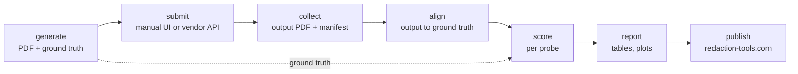

# PDF Redaction Benchmarks

An evaluation framework for third-party PDF redaction tools — public web services, desktop
software, vendor APIs — measured as **black boxes**: no source, no internals, only what a
submitted page comes back looking like.

Most tools are reachable only through a UI, one page at a time; some publish an API. Both
run through the same interface, and the single-page case is the one that shapes the design.
See [core.md](core.md).

## Pipeline

Only the second box varies: an operator on the UI path, an adapter on the API path.

## Documents

| Doc | Contents |
|---|---|
| [core.md](core.md) | Problem, constraints and what they force, architecture, interfaces |
| [workflow.md](workflow.md) | Run protocol — manual and API paths — and the run manifest |
| [adapters.md](adapters.md) | The `Tool` base class, the vendor registry, capabilities |
| [datasets/core.md](datasets/core.md) | Dataset families, probe packing, ground truth, distribution |
| [metrics/core.md](metrics/core.md) | Shared scoring model — read before the three below |
| [metrics/extraction.md](metrics/extraction.md) | Did the tool *see* the content? |
| [metrics/detection.md](metrics/detection.md) | Did the tool *recognise* what is sensitive? |
| [metrics/redaction.md](metrics/redaction.md) | Did the tool *remove* it? The leak layers. |
