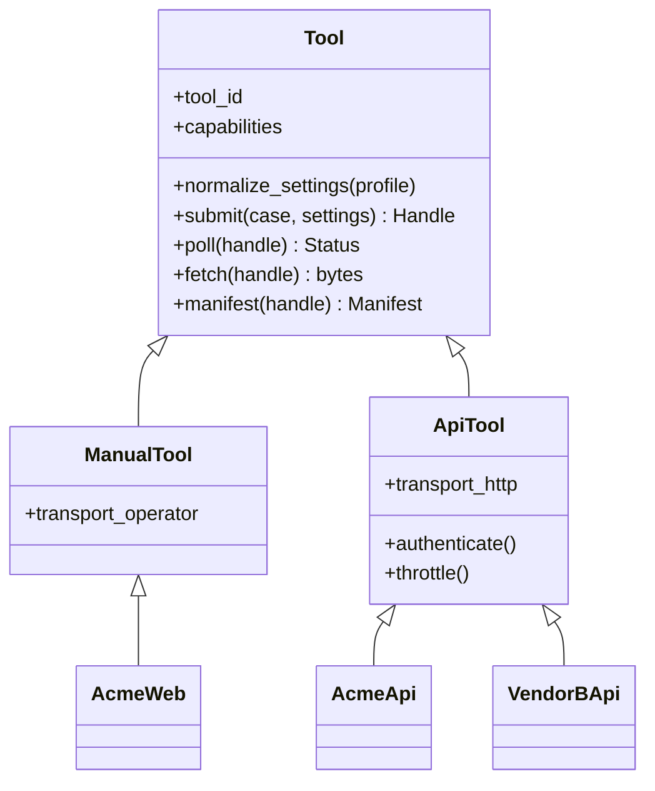

# Tool adapters

A benchmark run needs one thing from a vendor: hand it a PDF, get a redacted PDF back.
*How* that happens — a browser upload or an HTTP call — is a transport detail. One interface
covers both, and everything downstream (align, probe, score, publish) never learns which was
used.

## Why two-phase

`submit → poll → fetch`, not one blocking `redact()`. Vendor APIs are commonly job-based:
upload, receive a job id, poll, download. The manual path is the same shape with a slower
transport — submit writes a task, poll asks whether the operator has dropped the file yet,
fetch reads it.

Treating the manual case as the degenerate async case is what keeps a single code path.

## Base class

| Member | Purpose |
|---|---|
| `tool_id` | registry key, `vendor:surface` (below) |
| `capabilities` | what the tool claims to do — drives scoring scope |
| `normalize_settings(profile)` | map our profile onto vendor options |
| `submit(case, profile)` | normalize the profile, check declared limits, start the job; returns a handle |
| `poll(handle)` | `pending` · `ready` · `failed` · `rejected` |
| `fetch(handle)` | output bytes, exactly as the vendor returned them |
| `manifest(handle)` | the run-manifest fields the adapter knows → [workflow.md](workflow.md) |

Implemented in `src/pdfredeval/tools/`: `base.py` (the contract and the
inherited orchestration), `registry.py`, `manual.py`, `api.py`. An adapter sets `tool_id`,
`transport` and `capabilities`, then implements `_submit`, `poll` and `fetch`; run
directories, handles, manifests and backoff are inherited.

Adapters return **raw bytes and raw vendor responses**. Nothing is re-encoded, unwrapped or
tidied: the artefacts this benchmark hunts for live precisely in the parts a helpful client
library would strip.

## Registry

Keyed `vendor:surface`, because those are different products:

| id | |
|---|---|
| `acme:web` | the upload form a user meets |
| `acme:api` | the documented endpoint |
| `acme:desktop` | the installed binary |

A vendor's web UI and API routinely run different pipelines, defaults and model versions.
**Never merge their scores.** When they turn out to agree, that is itself a finding.

Adapters register by id and resolve out of tree (entry point / plugin), so a vendor can ship
and maintain their own without a PR here.

## Capabilities

Each adapter declares what its tool supports. Scoring a tool on what it never claimed to do
produces a misleading number:

| Capability | Example |
|---|---|
| stages | extraction · detection · redaction |
| categories | which PII types, which object classes |
| per-type control | can the caller ask for names only? |
| inputs | page limit, file size, accepted formats |
| mode | sync · async job · batch |
| determinism | is the same input guaranteed the same output? |

Probes outside a declared scope score `unsupported`: reported, excluded from rates, never
silently counted as a miss (→ [metrics/core.md](metrics/core.md)).

## Settings

Vendors expose incomparable knobs. The adapter maps one normalized profile onto them:

`{redact: [PERSON, EMAIL], mode: strict, ocr: auto}` → vendor parameters

The manifest records **both** — our profile and the raw payload sent — so a result is
reproducible by someone who does not use this framework.

## What the API path changes

| | Manual | API |
|---|---|---|
| Pages per run | ~1 | whatever rate limit and budget allow |
| n | probes on one page | as many cases as you can afford |
| Repeatability | one shot | run N times, measure the spread |
| Cost | operator time | money and quota |

Two consequences:

- **Probe packing stays the default.** It costs nothing on the API path, keeps one dataset
  usable by both, and per-call pricing rewards dense pages anyway.
- **Repeatability becomes measurable.** ML-based tools are not deterministic. Running one
  case N times turns "it missed the name" into "it misses that name 3 times in 10" — a
  property no manual run can observe, and part of the published result.

## Conduct

- **Credentials** come from the environment, never the repo and never a manifest. The
  manifest records *that* an account and tier were used, not the secret.
- **Respect rate limits and terms of service.** A benchmark that gets its account banned
  produces no data. Throttle by default.
- **Cases are synthetic**, so benchmarking never uploads real personal data to a third party.
  Keep it that way deliberately: never benchmark with real documents.
