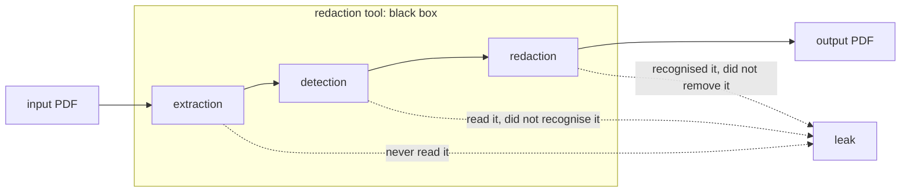
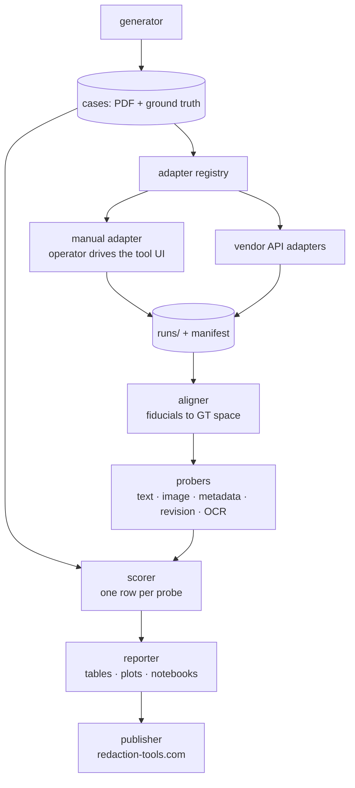

# Core

## Problem

Redaction tools ship as products, not libraries: a web upload form, a desktop button, a
closed API. We need comparable, publishable quality numbers for them — without source
access, without batch access, and for most services from a handful of pages.

A redaction tool is a three-stage chain. Each stage fails independently, and the observable
symptom is identical in every case: sensitive content survives.

Scoring the chain end to end is not enough — "0.6" tells a vendor nothing and a user little.
So each stage is also measured in isolation, with purpose-built pages, and every leak is
attributed to the stage that caused it.

| Stage | Channels |
|---|---|
| extraction | text layer, metadata, embedded images, text inside images (OCR) |
| detection | text PII; faces, signatures, QR/barcodes, stamps, logos |
| redaction | text, images, metadata |

## Constraints, and what they force

The constraints are hard and external. Each has one reasonable answer, and those answers
*are* the architecture:

| Constraint | Consequence |
|---|---|
| Access varies by vendor — most are UI-only, some publish an API | One `Tool` interface, two transports: a human or HTTP. Everything downstream is identical. → [adapters.md](adapters.md) |
| ~1 page per tool on the UI path | That page must carry dozens of independently scored **probes**: n≈40 per submission instead of n=1. → [datasets/core.md](datasets/core.md) |
| The output is a *re-encoded* PDF | Our ground-truth coordinates do not map onto it — it may be recompressed, rasterised, rotated, resized. Alignment becomes a pipeline stage, and our generator prints **fiducial marks** so it is solvable. |
| Free and trial tiers throttle, watermark, degrade | Tier and settings are part of a result's identity: recorded per run, never averaged across tiers. |
| Our datasets are public; tools train on public data | Pages are **procedurally generated from seeds**. The public split ships generator and seeds; the leaderboard split keeps its seed private. |
| Tools change silently and carry no version | Every result is stamped with observation date and output checksum. A score measures *a tool on a date*. |

## Architecture

The scorer emits **one row per probe**. That single decision makes every metric a groupby
over one long table and makes the notebook layer almost free.

## Interfaces

| Surface | Responsibility |
|---|---|
| CLI | `pdfredeval`: generate cases, inspect them, submit and collect runs, score what comes back, report on it. Publishing is not implemented yet |
| Python API | our own library surface — the same operations as calls, and the only real implementation |
| Vendor adapters | drive the tool under test: an operator on the UI path, HTTP on the API path → [adapters.md](adapters.md) |
| Reporter | tables for a terminal or a ticket, charts, and one self-contained HTML page per run or per comparison |
| Overlays | visual inspection: ground truth drawn over the output, so a disputed result can be looked at rather than argued about |
| Web UI — [redaction-tools.com](https://redaction-tools.com) ([repo](https://github.com/RedactionTools/redaction-tools)) | browse results, submit a run, host the leaderboard |
| Auto-publish | push scored runs to the site via login/API |

## Stack

- **Python**.
- **pandas** as the tabular spine — one row per probe, so metrics are groupbys and reports
  are pivots.
- **pypdf** to parse an output PDF and **pypdfium2** to rasterise it; **tesseract** on
  `PATH` for the OCR layer; **matplotlib** for the report's charts. Generation and the
  adapter layer deliberately need none of them, so the `score` and `report` extras are
  where they live. A missing engine makes the layers that
  need it report `unavailable` rather than clean, and every score records which engines
  and versions produced it.
- **Hugging Face Hub** for datasets: versioned, revision-pinnable, citable. A published
  score always names the dataset revision it was computed on.

## Non-goals

- Building a redaction tool. We measure; we do not compete.
- Being a redaction gateway. Adapters exist to benchmark vendors, not to proxy production
  traffic to them.
- Multi-page document understanding. The page is the unit; the constraint makes that a
  virtue rather than a compromise.
