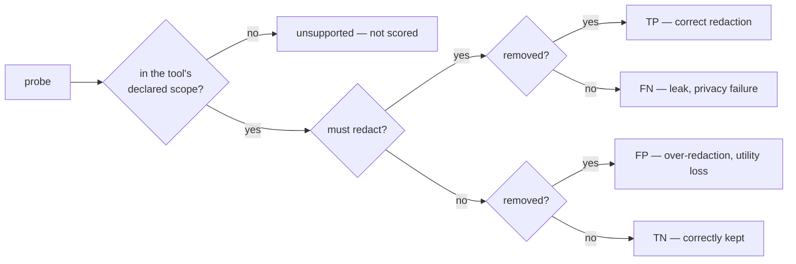

# Metrics — shared model

Read this first. `extraction.md`, `detection.md` and `redaction.md` all build on it.

## Unit of measurement: the probe

One probe = one independently scored item with known ground truth. Every check anywhere in
the framework emits **one row**:

`run_id · case_id · probe_id · kind · category · severity · difficulty · must_redact · outcome · evidence`

One long table. Every metric below is a groupby over it; every plot is a pivot. Nothing is
aggregated before it lands here.

## Notation

For one run — a single tool · settings · case · attempt — and each probe `i`:

| Symbol | Meaning |
|---|---|
| `m_i` | 1 if the probe must be redacted, 0 if it must survive (a distractor) |
| `s_i` | 1 if the probe is inside the tool's declared scope → [../adapters.md](../adapters.md) |
| `w_i` | severity weight |
| `r_i` | 1 if the probe was removed — computed below |
| `v_i`, `B_i` | its ground-truth value and its box |
| `c_i`, `k_i`, `d_i` | category, kind, difficulty tier |

Only scoped probes (`s_i = 1`) enter any rate. The rest are counted and reported separately,
never as misses.

## Substrate: the change mask

Most checks reduce to one question — *what did the tool actually alter?* Computed once per
run:

1. Render input and output at `DPI` (default 300).
2. Recover the output→ground-truth mapping from the four fiducials (homography `H`); warp
   the output into the input's frame.
3. Per-pixel difference: `M = { p : |in(p) − out(p)|∞ > δ_px }`, default `δ_px = 24`.
4. Morphological open then close, to drop anti-aliasing noise.

`M` is the **change mask**: every pixel the tool touched. It needs no cooperation from the
tool and makes no assumption about how a redaction was drawn — a filled rectangle, a blur, a
re-rendered page and a deleted glyph all register.

## Deciding `r_i`

Each probe kind has its own removal test. Thresholds are defaults, fixed per dataset version
and published with the score.

### Text — residual disclosure

Normalise both sides with `N()`: NFKC, casefold, expand ligatures, strip soft hyphens and
zero-width characters, collapse whitespace. Test against a **whitespace-stripped** variant
as well: stacked vertical text is drawn one glyph per operator, so extractors return it one
glyph per line, and a run compared with its separators intact matches a single character.

On the extracted side the stripping only joins runs of *single characters*, which is what a
stacked column looks like. Deleting every space instead manufactures adjacencies the page
never had: `+44 7669 074391` becomes `+447669074391`, which contains `6907` — the
identifying tail of an unrelated account number on the same sheet. The unit side loses all
its spaces, so a tool that returns the phone number unspaced still matches.

```
for each disclosure unit u in units_i:
    match(u) = longest_common_substring( N(u), N(out_text) )
    RDR(u)   = len(match(u)) / len( N(u) )
    test(u)  =  ( RDR(u) ≥ τ_text and len(match(u)) ≥ L_min )   # proportional
             or ( len(match(u)) ≥ D_c )                         # absolute

leak_i = OR over u of test(u)
r_i    = 1 − leak_i
RDR_i  = max over u of RDR(u)                                   # for grading
```

**Disclosure units**, not the whole string. A value is tested as its parts: `Whitfield
Diffie` carries the units `{Whitfield Diffie, Whitfield, Diffie}`. Redacted to `W. Diffie`
the whole-string ratio is 0.44 — a pass — while the surname survives intact and still
identifies. Any surviving unit is a leak.

The units come from the ground truth, not from a scoring-time heuristic: the generator
placed the value and knows which of its tokens identify (`Diffie` does, `Street` and `Ltd`
do not).

`out_text` is the concatenation of every text-bearing layer (→ [redaction.md](redaction.md)).
Defaults `τ_text = 0.5`, `L_min = 4` characters.

**Two tests, because a ratio alone is wrong for structured identifiers.** `RDR` treats every
character as equally identifying, which holds for a name and fails badly for an id. Masking
`123-45-6789` to `XXX-XX-6789` leaves `RDR = 0.36` — a pass on the proportional test, and a
disclosed SSN. So each category declares `D_c`, the shortest run of its own characters that
still identifies:

| Category | `D_c` | Rationale |
|---|---|---|
| national id, card, passport, phone | 4 | the tail alone re-identifies or authenticates |
| email | 4 | the domain is a quasi-identifier even with the local part gone |
| postcode, plate | 4 | short by nature |
| name, address, free text | — | proportional test only; no meaningful short prefix |

`L_min` guards the other direction: short values — "Li", "Ann" — collide by accident in any
page of prose, so the proportional test needs a floor. Both defaults live in the dataset.

The absolute test fires on a unit that survives **whole**, not on any floating run of `D_c`
characters — which is what both worked examples describe. `XXX-XX-6789` leaves the unit
`6789` intact; `@acme.com` leaves the unit `acme` intact. A floating run is a coincidence
rather than a disclosure: the domain `postcrate` shares `rate` with ordinary prose, and
scoring that as a leaked address reports a correct redaction as a failure. So `D_c` is the
floor a *declared identifying fragment* must clear, and its distinct job is admitting a
fragment shorter than `L_min` that a category says still identifies.

This is also what lets the generator guarantee what the scorer assumes: it rejects a value
whose unit appears in full anywhere else on the page, which is exactly this test.

Grade the survivors; "leaked" alone is not actionable:

| Condition | Grade |
|---|---|
| `RDR_i = 1.0` | full leak — the value is recoverable verbatim |
| leak via either test, `RDR_i < 1` | partial leak — counts as a leak in every rate |
| neither test fires | redacted |

Worked: `john.smith@acme.com` reduced to `@acme.com` is `RDR = 0.47`, under `τ_text` — but
9 characters clears `D_c = 4`, so it is a partial leak. It has to be: the employer survived.

The three tests cover three different escapes — a value mostly intact (proportional), an
identifying tail (absolute), an identifying token (units). A tool has to defeat all three.

### Regions — coverage, not IoU

```
Cov_i   = area( B_i ∩ M ) / area( B_i )
r_i     = 1 if Cov_i ≥ τ_cov                     (default 0.98)
Spill_i = area( M ∩ neighbourhood(B_i) \ B_i ) / area( B_i )
```

**Coverage, not IoU.** IoU penalises a redaction for being larger than its target, but
covering generously is not a privacy failure — it is a utility cost, already measured by
`Spill` and by the distractor probes. A face at IoU 0.5 can be perfectly identifiable, which
is why `τ_cov` sits near 1.

**Coverage reports; legibility decides.** "Changed" and "hidden" part ways in both
directions. A grey cover on a grey ground leaves the ground unchanged and the value
invisible; a gap between two word boxes is unchanged page; a tool that redraws the text in
bold changes every glyph pixel and leaves the value legible. So `Cov_i` is published, and
the pixel verdict asks about the ink directly:

```
ink_i      = { p ∈ B_i : |in(p) − med_w(in)(p)| > δ_px }          w = 2pt, inside B_i
revealed_i = { p ∈ ink_i : |out(p) − med_w(out)(p)| > δ_px, same sign as in ink_i }
             minus residues smaller than ¼ of one character's ink (merged within 0.5pt)
leak_i     = |revealed_i| ≥ ½ · |ink_i| / chars(v_i)              half a character showing
```

The neighbourhood stops at the box, so a cover's own edge against the page is not read as
ink; "same sign" means a light label on a dark cover is not the dark text under it. A probe
with no characters (an image) leaks when `|revealed_i| / |ink_i| > τ_reveal` (0.02).

### Images

64-bit perceptual hash per embedded image. Probe `i` leaks if any image in the output
satisfies `Hamming(h_i, h_j) ≤ τ_hash` (default 10).

### Metadata

The text test again, over every metadata value — Info dict, XMP, custom keys, document id,
piece info. Searched by value, never by key: ground truth records *that* a probe lives in
metadata, not where, so a tool that moves a value between keys instead of removing it is
caught as well.

## Outcome taxonomy

Every scoped probe lands in exactly one cell:

| | `r_i = 1` removed | `r_i = 0` kept |
|---|---|---|
| `m_i = 1` | **TP** correct redaction | **FN** leak |
| `m_i = 0` | **FP** over-redaction | **TN** correctly kept |



`unsupported` is reported, excluded from every rate, and never counted as a miss: a
text-only tool is scored on text and marked silent on faces, not failed for them.

A third state sits beside the removal tests and is not an outcome at all. Every layer
answers **leaked**, **clean**, **not applicable** or **unavailable**, and the last two are
distinct from each other and from clean. Invisible text draws nothing, so pixel coverage of
its box is *not applicable*; an OCR pass with no engine installed is *unavailable*. Folding
either into "clean" publishes "no leak found" for a check that never ran. Rows decided with
a layer unread are counted in the report.

When *every* layer comes back unavailable — an output that does not parse and does not
render — the probe is `undecided`: reported, excluded from every rate, and never counted as
removed. Without it an unopenable file scores `LR = 0`, which is the most flattering number
in the benchmark and the least earned. `undecided` and `unsupported` are deliberately
separate: one is what we managed to look at, the other is what the tool claims to do.

The four cells, `unsupported`, `undecided` and the held-out `ambiguous` probes are disjoint
and sum to the probe count. A published table that does not reconcile with its own
denominators is hiding a population.

## Primary metrics

| Metric | Measures | Formula | Best |
|---|---|---|---|
| **Leak Rate** `LR` | targets the tool left behind | `FN / (TP + FN)` | 0 |
| **Weighted Leak Rate** `wLR` | the same, by consequence | `Σ_{m=1} w_i(1−r_i) / Σ_{m=1} w_i` | 0 |
| **Over-Redaction Rate** `ORR` | distractors destroyed | `FP / (FP + TN)` | 0 |
| **Area Over-Coverage** `AOC` | page needlessly destroyed | `(area(M) − Σ_{m=1} area(B_i)) / area(page)` | 0 |
| **Text Retention** `TR` | is the document still usable | `chars extractable in output / chars that should remain` | 1 |
| **Privacy** | the privacy axis | `1 − wLR` | 1 |
| **Utility** | the utility axis | `1 − ORR` | 1 |

### Why not precision and F1

`precision = TP/(TP+FP)` depends on the ratio of targets to distractors — a ratio **we
choose** when generating the page. Rebalancing the dataset would move every tool's precision
without any tool changing. `LR` and `ORR` are rates over two separate populations and are
invariant to that mix. Report precision and F1 for familiarity if you like; never rank on
them.

(Precision over a tool's *own reported entities* is a different quantity and is legitimate —
see [detection.md](detection.md).)

### One number, where one is unavoidable

```
RQS_β = (1 + β²) · Utility · Privacy / ( β² · Utility + Privacy )        β = 2
```

A weighted harmonic mean tilted toward privacy. Two properties earn it:

- **Zero if either axis is zero.** Redact-everything (`Utility = 0`) and do-nothing
  (`Privacy = 0`) both score 0 — exactly the degenerate strategies the two axes exist to
  catch.
- β puts the trade-off in the open, as a number someone can argue with.

It stays a ranking convenience. `LR` and `ORR` are the result.

## Severity weights

| Severity | `w` | Example |
|---|---|---|
| critical | 8 | national id, card, passport, face, signature |
| high | 4 | full name, email, phone, home address |
| medium | 2 | date of birth, employer, job title |
| low | 1 | city, year, gender |

Doubling per level, so one critical leak outweighs any run of low ones short of eight.
Weights ship **with the dataset**, not the scorer, so scores stay comparable.

## Two axes

```
 privacy
 (no leaks)
    ▲
  1 │  redact-everything ·          ┌────────────┐
    │    blacks out the page,       │   target   │
    │    useless document           └────────────┘
    │
    │
  0 │  worst case ·                              · do-nothing
    │    destroys the page              returns the input untouched
    └────────────────────────────────────────────▶ utility
     0                                            1   (nothing over-redacted)
```

Blacking out the whole page scores perfectly on privacy. Returning the input scores
perfectly on utility. **Both axes are always published**, leak rate first: an
under-redaction discloses data, an over-redaction only wastes a page.

## Aggregation

probe → case → tool · settings · date. Each level keeps its detail:

- **Per probe** — outcome plus evidence. The raw record; nothing is lost.
- **Per case** — rates split by kind, category and severity. The per-category breakdown is
  mandatory: "94% overall" hides "0% on IBANs".
- **Per run** — `LR`, `wLR`, `ORR`, `AOC`, `TR`, plus the breakdown above.

**Pool counts; never average rates.**

```
LR(set of runs) = Σ FN / Σ (TP + FN)
```

Averaging per-case rates silently over-weights the cases that carry fewest probes.

The reporter aggregates the same way — it concatenates the long tables and recomputes
from the counts, never from the per-run numbers. It also refuses to pool quietly across
incompatible runs: results scored under different threshold tables, or citing different
dataset revisions, are flagged in the report rather than averaged into one figure.

## Uncertainty

**Interval on a rate.** Wilson score, because it stays sane at `p̂ = 0` where the normal
approximation collapses — and `p̂ = 0` is precisely where a good tool sits:

```
centre = ( p̂ + z²/2n ) / ( 1 + z²/n )
half   = z · sqrt( p̂(1−p̂)/n + z²/4n² ) / ( 1 + z²/n )        z = 1.96
```

0 leaks in 40 probes is `[0, 0.088]`, not "100%".

**Clustering.** Probes on one page share a fate: one timeout, one mis-rotation, one skipped
OCR pass fails all of them together. Treating 40 clustered probes as 40 independent trials
overstates confidence by the design effect `1 + (n̄ − 1)ρ`. So:

- Always publish the number of **pages** beside the number of **probes**.
- With more than one page, interval by **bootstrap over pages** — resample pages with
  replacement, recompute the pooled rate, take the 2.5 / 97.5 percentiles.

**Repeatability**, on the API path only:

```
Instability = | { i : r_i not constant across N attempts } | / |P|
```

Report `LR` as mean ± sd over attempts. A tool at `LR = 0.1` with `Instability = 0.3` is not
a 90% tool; it is a coin toss with a flattering average.

## Defaults

| Symbol | Meaning | Default |
|---|---|---|
| `DPI` | render resolution for raster checks | 300 |
| `δ_px` | per-pixel difference threshold | 24 / 255 |
| `τ_text` | residual disclosure tolerated | 0.5 |
| `L_min` | floor on the proportional text test | 4 chars |
| `D_c` | absolute disclosure length, per category | 4 chars, or none |
| `τ_cov` | coverage required to call a region redacted | 0.98 |
| `τ_hash` | pHash Hamming distance for image identity | 10 / 64 |
| `τ_span` | char-span Jaccard to match a reported entity | 0.5 |
| `τ_iou` | IoU to match a reported box | 0.5 |
| `z` | interval confidence | 1.96 (95%) |
| `β` | privacy weight in `RQS` | 2 |

Four more are implementation constants rather than metric definitions, published with the
rest because they change results just as much:

| Symbol | Meaning | Default |
|---|---|---|
| ink floor | share of a probe's box that must carry ink in the *input* before the rendered-pixel layer has anything to say about it | 0.01 |
| residual | reprojection error above which alignment is not trusted and every raster layer reports `unavailable` | 6 px |
| page-rewritten | share of the page in `M` above which the output is treated as re-rendered wholesale and pixel verdicts are flagged rather than believed | 0.5 |
| `ε` | neighbourhood for `Spill` and `Collateral` | 12 pt |

Every published score names the dataset revision **and** this table. Change a threshold and
you have changed the benchmark.
