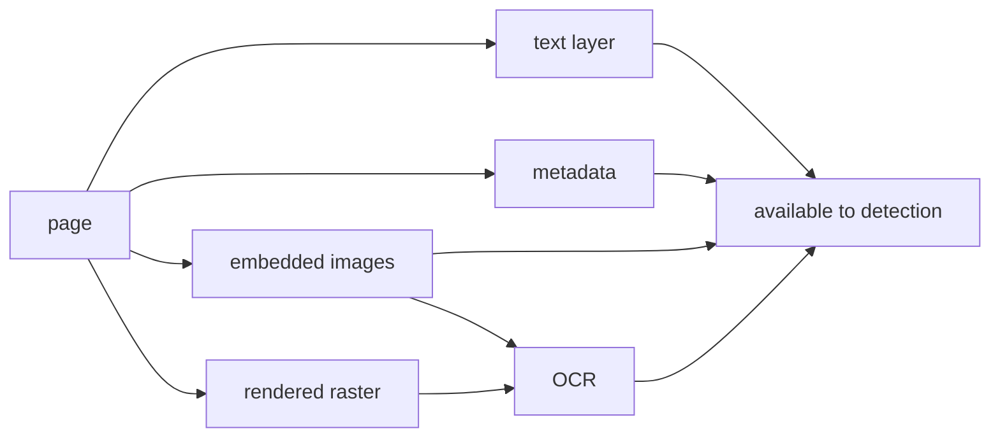

# Extraction metrics

Extraction bounds everything downstream: **a tool cannot redact what it never read.** A zero
here explains a zero in [detection.md](detection.md), and telling the two apart is the whole
point of per-stage probes.

Notation from [core.md](core.md).

## The inference

Extraction is not directly observable in a black box. It is inferred by construction: plant
a value so that it is reachable through **exactly one** channel, then see whether redaction
reaches it. A single-channel probe that survives proves the tool never opened that channel.



## Channel Reach

The primary metric, computable for every tool including UI-only ones:

```
Reach_k = | { i : channel_i = k, m_i = 1, r_i = 1 } | / | { i : channel_i = k, m_i = 1 } |
```

The redaction rate restricted to probes reachable only through channel `k`. `Reach_k = 0`
across a channel's probes is a strong, single-sentence finding: *this tool does not read
metadata*.

| Channel | Probe construction |
|---|---|
| Text layer | the string exists only in the content stream |
| Metadata | the value exists only in Info / XMP / a custom key — never on the page |
| Embedded images | a known bitmap as an image XObject, its `pHash` recorded |
| Image text | text rendered into a bitmap and absent from the text layer |

Reach is a floor, not an equality: a tool could read a channel and still fail to detect or
redact. It bounds extraction from below, which is all a black box permits.

## Observed mode

Where the adapter exposes extracted text or entities (→ [../adapters.md](../adapters.md)),
extraction is measured directly:

| Metric | Measures | Formula |
|---|---|---|
| **Character recall** | text layer fidelity | `chars of N(v_i) present in N(extracted) / len(N(v_i))` |
| **CER** | OCR character error | `levenshtein(ref, hyp) / len(ref)` |
| **WER** | OCR word error | `levenshtein_words(ref, hyp) / word_count(ref)` |
| **Image recall** | images the tool found | `\|{ GT images with a pHash match ≤ τ_hash }\| / \|GT images\|` |
| **Metadata key recall** | metadata keys read | `\|{ GT keys present in extraction }\| / \|GT keys\|` |

CER and WER are computed on the normalised forms `N()`, so a tool is not penalised for
casing or ligature expansion.

## Two failure surfaces

Text extraction fails for two unrelated reasons, and they need separate segmentation:

| Surface | Breaks | Segmented by |
|---|---|---|
| **Structural** — how the PDF is built | the text-layer path | traps (below) |
| **Rendering** — how the text looks | the OCR path | conditions (below) |

A tool can ace one and fail the other. Pooling them produces a number that explains nothing.

## Rendering conditions

Four axes, one level per probe, each tagged in the ground truth so every metric can be
grouped by it. Condition probes carry PII values: in inferred mode, redaction is the only
evidence the tool read them at all.

### Orientation

| Level | Description |
|---|---|
| `horizontal` | baseline at 0° — the control |
| `rot90`, `rot270` | the run turned a quarter turn — table headers, spine labels, stamps |
| `rot180` | upside down — a page rescanned the wrong way |
| `skew` | arbitrary small angle, ±5° and ±15° — photographed or crooked scan |
| `vertical` | glyphs upright, stacked top-to-bottom — CJK vertical writing, or Latin one glyph per line |

**`vertical` is not `rot90`.** A rotated Latin run is recovered by rotating the raster; a
stacked column is not — its glyphs are already upright, so rotating turns every one of them
sideways. The two need different OCR modes, and a tool that passes `rot90` can score zero on
`vertical`. Separate levels, always.

### Polarity and ground

| Level | Description |
|---|---|
| `normal` | dark on light — the control |
| `inverse` | light text on a dark or saturated fill |
| `low-contrast` | contrast ratio 3:1 and 1.5:1 |
| `on-image` | text over a photograph |
| `screened` | text over a watermark or tint |
| `highlighted` | text on a coloured highlight box |

**`inverse` earns its own level twice over.** OCR pipelines binarise assuming dark-on-light;
polarity detection is a separate step many skip, so inverse text can return nothing at all.
And it is what redaction *produces*: the moment a tool paints a dark rectangle over live
text, that text becomes an inverse-contrast case. An OCR-of-output leak check that cannot
read inverse text will report "covered" over plainly legible words
(→ [redaction.md](redaction.md)).

### Glyph provenance

| Level | Description |
|---|---|
| `vector` | born-digital text layer — the control for structural probes |
| `print-clean` | rasterised at 300 DPI, no noise — the control for OCR probes |
| `print-degraded` | bleed-through, grain, softening, speckle and coarse quantisation, applied in that order |
| `hand-block` | handwritten block capitals |
| `hand-cursive` | handwritten cursive |
| `hand-mixed` | a form: printed labels, handwritten values — the realistic case |

Every `print-*` and `hand-*` probe carries **no text layer at all** — its value exists only
as pixels, so its channel is `image_text` and OCR is the only path to it. `on-image` is the
exception: it is vector text over a photographic ground, so only the background is raster.

Handwriting needs HTR, not OCR, and most redaction tools have none. `hand-*` is therefore a
**capability** axis rather than a difficulty axis: the expected result is `Reach = 0`, and an
adapter that does not declare handwriting support scores these `unsupported`
(→ [../adapters.md](../adapters.md)).

That exclusion must never read as a pass. A tool that cannot see handwriting will leave
handwritten PII in place on a real document, so an unsupported channel is published as a
**coverage statement** on the result — *this tool does not attempt handwriting* — beside the
rates it is excluded from.

> Fidelity caveat: handwriting is rendered from bundled handwriting faces — `Caveat` for
> `hand-block`, `Dancing Script` for `hand-cursive` and `hand-mixed` — with per-glyph
> jitter in position and advance. That is more regular than real handwriting, so `hand-*`
> is a **floor** on difficulty, not a substitute for samples of real writing. Each case
> records the SHA-256 of every face it used, so a disputed result names the exact glyphs
> it came from.

### Scale

| Level | Description |
|---|---|
| `pt10` | body text — the control |
| `pt6` | fine print, disclaimers, footers |
| `pt4` | the limit of legibility at 300 DPI |

Recorded with the effective DPI, since points alone do not determine whether OCR can resolve
a glyph.

## Design: one factor at a time

The full cross product is 5 × 6 × 6 × 3 = 540 cells, against a one-page budget. So vary one
factor at a time from the control, then add the interactions where tools actually break:

```
1 control + 4 orientation + 5 polarity + 5 provenance + 2 scale   = 18 cells
+ interactions: every pair worth testing as a real document —
  a photographed handwritten note (skew × hand-cursive), a page
  scanned upside down (rot180 × print-degraded), a watermarked
  scan (screened × print-degraded), faint fine print
  (low-contrast × pt4), a turned margin note (rot90 × hand-block)
+ a few triples, because failures compound and a tool that
  survives every pair can still fall over on three at once       = 36 cells
                                                                  = 54 cells
```

Every level of every axis appears in the one-factor block, so the block is complete by
construction and a test asserts it stays that way.

The matrix is **its own case family**, not packed onto the PII page whose slots are already
spent (→ [../datasets/core.md](../datasets/core.md)). Quarter-turned and stacked runs sit
in a band of their own columns, because they are narrow and tall — the opposite shape to a
text row.

## Structural traps

The other surface: probes that break the text-layer path regardless of how the page looks.

| Trap | What it breaks |
|---|---|
| Ligatures, missing `ToUnicode` | extracted text ≠ visible text; naive matching misses the leak |
| Multi-column layout, tables | reading order scrambles, and context-dependent PII detection with it |
| Invisible text — render mode 3, white-on-white | extractable but unseen: a leak no visual review catches |
| Text in annotations, form fields, tooltips | not in the page content stream; frequently skipped entirely |
| CID / subset fonts, custom encodings | extraction returns glyph ids, not characters |
| Scan-only page | the text layer is empty; forces the OCR path |
| Text as vector outlines | no text objects at all; only OCR of the raster can see it |

## Per-condition metrics

Every metric above, restricted to a segment:

```
Reach_k,x = | { i : channel_i=k, cond_i=x, m_i=1, r_i=1 } | / | { i : channel_i=k, cond_i=x, m_i=1 } |
CER_x     = CER restricted to probes with condition x
Trap_t    = | { i : trap_i=t, m_i=1, r_i=1 } | / | { i : trap_i=t, m_i=1 } |
```

The reportable number is the **cost of the condition**, not the rate itself:

```
Δ_x = Reach(control) − Reach_x
```

`Δ` isolates the condition from the tool's baseline ability. "This tool loses 0.6 on inverse
backgrounds" is comparable across tools; "this tool scores 0.3 on inverse backgrounds" is not,
because a tool that scores 0.3 everywhere has no inverse-background problem.

Report the vector, never the mean. A tool strong on clean horizontal text and blind to
everything else is a specific, publishable shape of failure that a pooled score hides.
