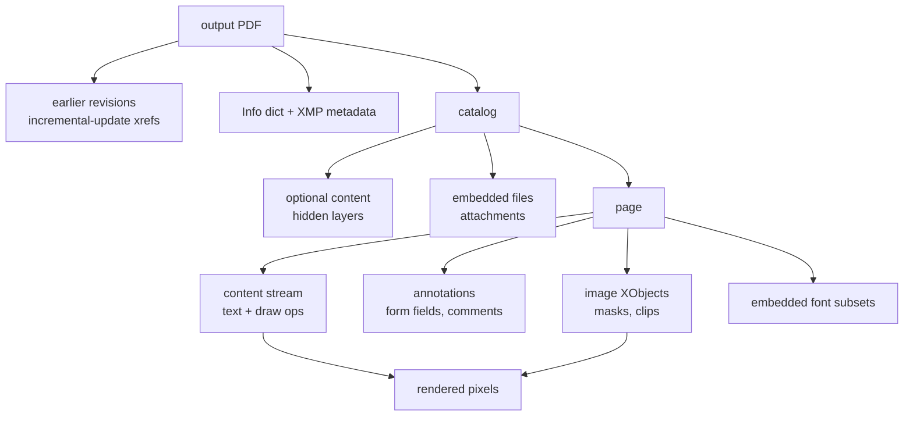

# Redaction metrics

**Redaction is removal, not covering.** The canonical real-world failure is a black rectangle
drawn over text that is still in the content stream: it looks redacted, it prints redacted,
and `pdftotext` returns the name. Verification is therefore *layered* — one check is never
enough.

Notation and the change mask `M` come from [core.md](core.md).

## Where a value survives



Every box is somewhere a redacted value has been recovered in the wild. A tool that clears
the content stream and nothing else passes visual review and fails here.

## Leak layers

Each layer `ℓ` is an independent test yielding `leak(i,ℓ) ∈ {0,1}`. Severity reflects what a
survival means, not how hard the layer is to reach.

Every layer is probed **in triplicate**: one probe per layer cannot separate a real failure
from a fluke, and a rate of 0/1 or 1/1 carries an interval spanning almost the whole range.

| Layer `ℓ` | How `leak(i,ℓ)` is computed | If it survives | Severity |
|---|---|---|---|
| Rendered pixels | at least half a character of the input's ink still legible at `B_i` (core.md, *legibility decides*); `Cov_i` reported beside it | visible to anyone | critical |
| Content stream | `leak_i` by the text test over extracted page text drawn at the probe or at no probe | copy-paste, `pdftotext`, any parser | critical |
| Earlier revisions | `leak_i` by the text test over every prior xref generation, parsed separately | "save" instead of export; trivially recovered | critical |
| Image XObjects | `Hamming(h_i, h_j) ≤ τ_hash` for any output image, ignoring crop and mask | a crop is a view, not a deletion | critical |
| Metadata | `N(v_i)` in Info, XMP, custom keys, document id, piece info | invisible, survives forwarding | high |
| Annotations, form fields | `leak_i` by the text test over widget values, `/Contents`, tooltips | shown by many viewers | high |
| Attachments, optional content | the two tests above, run inside embedded files and each OCG | one toggle away | high |
| OCR of the output | `leak_i` by the text test over OCR of the rendered page at `DPI` **and of each probe's own box**, **run at both polarities**; judged on text read at the probe or at no probe | catches translucent or hairline covers | high |
| Font subsets | glyphs present in the subset but on no visible run | narrows the value; partial disclosure | low |

Two notes on the OCR layer, because it is the one that quietly fails open:

- **Run it at both polarities.** A dark rectangle painted over live text leaves white-on-black
  — exactly the case a dark-on-light binariser drops. An OCR pass that cannot read inverse
  text reports "covered" over legible words, scoring a leak as a clean redaction
  (→ [extraction.md](extraction.md)).
- **Run it on the rotations the page contains.** A vertical or quarter-turned run that
  survives is invisible to a single horizontal pass.
- **Say so when there is no engine.** With no OCR installed the layer reports
  `unavailable`, which is neither a pass nor a leak, and the result carries it as a
  coverage statement. "Found nothing" from a pass that never ran is the same sentence as
  "no leak", and a published score must never confuse the two.

### Combining layers

```
leak_i = OR over ℓ of leak(i, ℓ)
r_i    = 1 − leak_i
```

The worst layer sets the outcome: a probe is redacted only if it survives **none**.

## Attribution

The point of layering is naming the failure, so two derived metrics per layer:

| Metric | Measures | Formula |
|---|---|---|
| **Layer Leak Rate** | how often this layer catches a leak | `\|{ i : m_i=1 ∧ leak(i,ℓ) }\| / \|{ i : m_i=1 }\|` |
| **Exclusive Leak Rate** | leaks *only* this layer catches | `\|{ i : leak(i,ℓ) ∧ ¬leak(i,ℓ′) ∀ ℓ′≠ℓ }\| / \|{ i : m_i=1 }\|` |

`LR` says a tool leaks. The Layer Leak Rate vector says *how*, which is the part a vendor
can fix. Exclusive Leak Rate justifies each layer's place in the suite: a layer that never
catches anything the others miss is dead weight and can be retired.

Three layers are implemented and currently **inert**, because the generator plants nothing
for them yet: image XObjects (no image, face, signature or code probes, and no reference
hash in ground truth), attachments (no embedded files) and font subsets (base-14 fonts, so
no subset to leave a residue). They report zero applicable probes rather than a pass, and
the Exclusive Leak Rate is exactly the number that will say whether they earn their place
once the probes exist.

## Over-redaction

The same machinery, read in the other direction — distractors that should have survived.
Reported beside leaks, never traded against them.

| Metric | Measures | Formula |
|---|---|---|
| **`ORR`** | distractors destroyed | `FP / (FP + TN)` |
| **`AOC`** | page needlessly destroyed | `(area(M) − Σ_{m=1} area(B_i)) / area(page)` |
| **Spill** | how far a redaction overshoots its target | `mean_i over m_i=1 of Spill_i` |
| **Collateral** | over-redaction caused by a neighbour | `\|{ j : m_j=0, r_j=1, min_i dist(B_j, B_i) < ε }\| / \|{ j : m_j=0 }\|`, over targets `i` |

Collateral separates two different faults that `ORR` alone conflates: a tool with a blunt
brush (redacts correctly, but swallows whatever sits next to the target) versus a tool with
a loose detector (redacts things that merely look sensitive anywhere on the page). `ε`
defaults to one line height.

## Document survivability

A redacted file nobody can use is a failure of a different kind. Binary gates, cheap, run on
every output; a failed gate is published as a flag beside the scores, not folded into them.

| Gate | Passes when |
|---|---|
| Opens | the output parses as a valid PDF |
| Pages | page count unchanged |
| Geometry | page size within 1% of the input |
| Text retained | `TR ≥ 0.9` |
| Not rasterised | output keeps more than 5% of the input's extractable characters |

The last gate catches the blunt instrument: flattening the page to an image redacts
everything perfectly and destroys the document. It scores `LR = 0` and must never be
reported without `TR` beside it.
