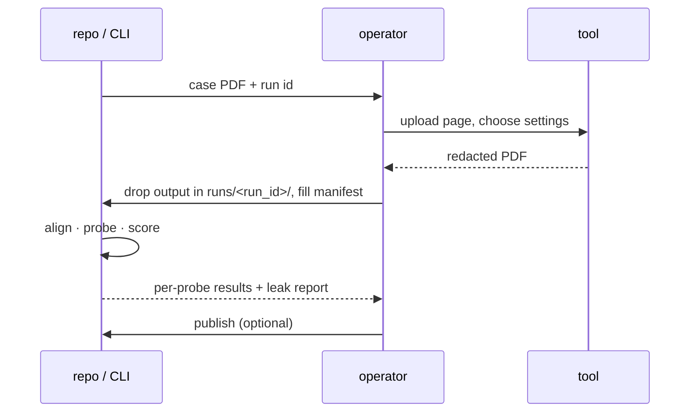
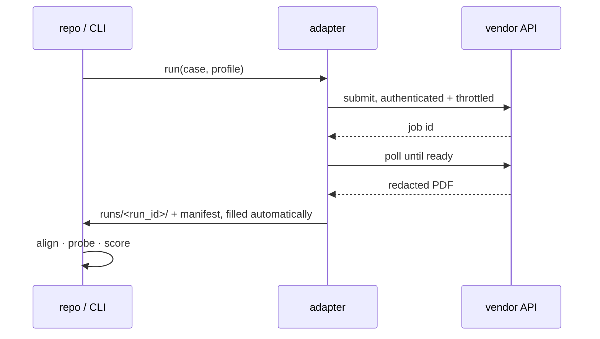

# Run workflow

Submission is the only step that varies — an operator on the UI path, an HTTP call on the
API path (→ [adapters.md](adapters.md)). Everything else is identical, and both paths write
the same `runs/` layout and the same manifest.

| | Manual | API |
|---|---|---|
| Submission | operator drives the tool UI | adapter calls the endpoint |
| Manifest | filled in from what the UI showed | emitted by the adapter |
| Cadence | one case at a time | whatever the rate limit allows |

This protocol exists so a result recorded by one operator today is reproducible by another
operator — or by an adapter — later.

## Manual path



## API path



One case, one run, one manifest. A retry with different settings is a **new run** — settings
are part of a result's identity and are never averaged over. A repeat with *identical*
settings is a new run too, indexed by `attempt`: that is how repeatability is measured.

## Run manifest

Recorded per run, next to the output PDF. Without these fields a number is not publishable:

| Field | Why |
|---|---|
| `run_id` | primary key; ties output, manifest and score rows together |
| `case_id`, `dataset_revision` | *what* was submitted, pinned to a Hugging Face revision |
| `tool_id` | registry key `vendor:surface`; web, api and desktop are different tools |
| `transport`, `attempt` | manual or api; repeat index, for measuring variance across identical runs |
| `tool_version`, `observed_at` | tools change silently; a score measures a tool *on a date* |
| `url` / `build` | which deployment — web, desktop and self-hosted differ |
| `tier` | free / trial / paid; throttling and watermarking differ per tier |
| `settings` | every option chosen, verbatim, defaults included — the normalized profile *and* the raw vendor payload |
| `operator` | who ran it, for follow-up questions |
| `input_sha256`, `output_sha256` | proves the scored bytes are the delivered bytes |
| `notes` | what the UI did that the file cannot show — warnings, forced OCR, a silently dropped page |

## Layout

```
benchmarks/v<version>/runs/<vendor-surface>/
  <run_id>/
    handle.json       # the submission, so it survives to a later process
    manifest.json     # the table above; `output_name` names the file below
    TASK.md           # manual path only: instructions for the operator
    <any name>.pdf    # the tool's output, exactly as downloaded, never re-saved
    screenshots/      # optional: settings UI, warnings
    score/            # generated: probe rows, leak report
    report/           # generated: report.md and the self-contained report.html
```

`handle.json` exists because the manual path spans processes and days: an operator submits
on Monday, and a different invocation collects and scores on Wednesday.

The output PDF stays **byte-identical to the download**. (Runs made before the versioned
layout called it `output.pdf`; that name is still read.) Opening and re-saving it in any
viewer can silently strip the very artefacts the benchmark hunts for — earlier revisions,
metadata, annotations — turning a real leak into a passing score.
